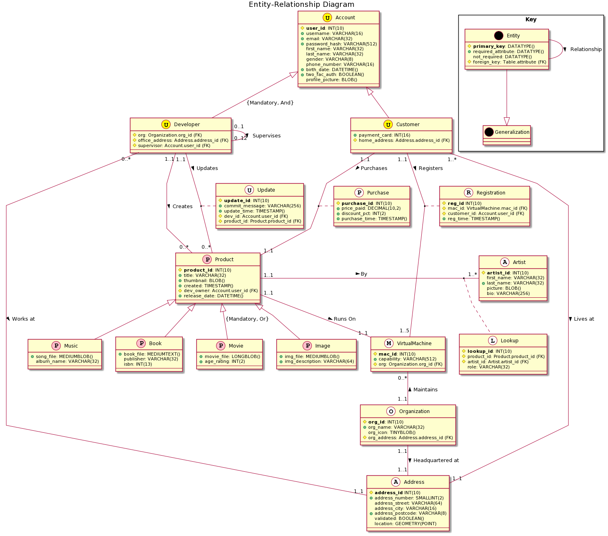

# Question One

Consider the following relational database schema where the underline attributes are the primary keys,
• Lecturer(lId, name, title, address)
• Student(sId, name, major)
• Course(cId, cName, lId)
• Enrolment(cId, sId)
Write relational algebra expressions for the following queries.

1.1 *Find the lecturers who teach at least one course. Show the lIds of those lectures.*

$\Pi_{lId}(Lecturer \bowtie Course)$

1.2 Find the students who have the same name as some of lecturers. Show the
IDs and names of the students.

$\Pi_{Student.sId, Student.name}(\sigma_{Student.name = Lecturer.name}(Student \times Lecturer) )$

3. Find the students who do not enrol in any course taught by ‘John Smith’. Show the names of those students.

$$
\Pi_{name}(Student) - \Pi_{Student.name}( \sigma_{Lecturer.name = 'John Smith'}(Student \bowtie Enrolment \bowtie Course \bowtie Lecturer) )
$$

4. Find the courses for which there are not both students with name ‘John’
or ‘Alice’ who enrol in. That is, that in any course appeared in the outcome, there may
be a student with name ‘John’ or a student with name ‘Alice’, but there should not be
both of them. Show the cIds of those courses.

$\Pi_{cId}(Course) - (\Pi_{cId}(\sigma_{name = 'Alice'}(Student \bowtie Enrolment \bowtie Course)) \cap \Pi_{cId}(\sigma_{name = 'John'}(Student \bowtie Enrolment \bowtie Course)) )$

5. Find the students who have the same name as some other student. Show
the names of the students.

$\Pi_{Student.name}(\sigma_{Student.sId \neq Repeat.sId }( \sigma_{Student.name = Repeat.name}(Student \times \rho_{Repeat}(Student) ) ) )$


6. Find the students who take all the courses taught by ‘David Cheung’. Show only the IDs of these students. 

$\Pi_{sId,cId}(Student \times Enrolment) \div \Pi_{cId}( \sigma_{Lecturer.name = 'David Cheung'}(Course \bowtie Lecturer) )$

# Question Two.

## Enhanced Entity-Relationship Diagram



## Discussion

### The Specification

The specification required that the database design included:
- *organizations* with a unique name and an address;
- *virtual machines* with a unique id and a description of capability stored as a string; 
	* these "must and can only belong to one organization";
	* these become associated with ('owned by') a customer account, and then cannot be owned by other accounts
- user *accounts* with unique account id, personal information such as email, gender, phone number, DOB; these can be *developer* or *customer* accounts;
	* *developer* accounts are affiliated to one and only one organization, and have an office address
	* *customer* accounts have a credit card number and home address; and must have at least one virtual machine to run products
- *e-products* which are 'developed' by a developer account and purchased by a customer account; these should have a unique product id and release date; 
	* these can be one of *music*, *book*, *movie*, or *image*, each with their own attributes;
	* a book is required to have a title and at least one author
- the price and discount information of a deal, requiring implicity that we record *purchases* as an entity
- the date that a virtual machine is owned by a customer, requiring implicitly that we record *registrations* as an entity

### Implementation

Most of this is straightforward and can be implemented directly as required. All entities have a unique integer id which acts as their primary key, although this was not always strictly required or necessary. Organizations for example are required to have a unique name, so this could have been their primary key. However for the sake of consistency it seemed better to have integer PKs.

Since an address is required for a user account and for an organization, this has been an entity in its own right.

Slightly more subtle, is the suggestion that a book might have more than one author. In order to allow a book to have multiple authors it is necessary to make authors a separate entity in the database, and use a *lookup* table to record connections between books and authors. Since this will also be the case for other types of products, I suggest an *artist* table that can include authors, editors, and illustrators (for books), as well as directors, producers, and actors (for movies), singers and musicians (for music), and artists and graphic designers (for images) -- the nature of the role is included in the lookup table, thus making it easy to find all involved in making a particular product (be it book, movie, image or music), or conversely to find all the movies a particular actor has been in.

I have also assumed that after its initial creation by a developer, a product may need updating. Details of the update are recorded in a separate *update* entity, which may be made by a different developer than the one who initially created the product, though the initial creator retains ownership rights unless he makes another developer the `dev_owner`.

Other assumptions should be clear from the diagram. For example, I have suggested that a team of up to twelve developers may be supervised by another developer. I have also suggested that a customer account be limited to having five virtual machines registered at a time. I have assumed that a user account will be authenticated with a password, which in case of security breach should only be stored as a hash.

There is nothing in the specification that is not implemented in my database design. I have also suggested MYSQL datatypes for each attribute, although this was not explicitly requested.

### PlantUML

I used [PlantUML](https://plantuml.com/) to generate the diagram from code:

```
@startuml
skinparam linetype polyline

class Organization <<O, white>>{
# **org_id**: INT(10)
+ org_name: VARCHAR(32)
org_icon: TINYBLOB()
# org_address: Address.address_id (FK)
---
}

class VirtualMachine <<M, white>>{
# **mac_id**: INT(10)
+ capability: VARCHAR(512)
# org: Organization.org_id (FK)
---
}


class Address <<A, white>>{
# **address_id** INT(10)
+address_number: SMALLINT(2)
address_street: VARCHAR(64)
address_city: VARCHAR(16)
+address_postcode: VARCHAR(8)
validated: BOOLEAN()
location: GEOMETRY(POINT)
---
}

class Account <<U, yellow>>{
# **user_id** INT(10)
+ username VARCHAR(16)
+ email VARCHAR(32)
first_name VARCHAR(32)
last_name VARCHAR(32)
gender VARCHAR(8)
phone_number INT(12)
+birth_date DATETIME()
+two_fac_auth: BOOLEAN()
profile_picture: BLOB()
---
}

class Customer <<U, yellow>>{
+ payment_card: INT(16)
# home_address: Address.address_id (FK)

---
}

class Developer <<U, yellow>>{
# org: Organization.org_id (FK)
# office_address: Address.address_id (FK)
# supervisor: Account.user_id (FK)
---
}

class Product <<P, pink>>{
# **product_id**: INT(10)
+ title: VARCHAR(32)
+ thumbnail: BLOB()
+ created: TIMESTAMP()
+ release_date: DATETIME()
---
}

class Music <<P, pink>>{
+song_file: MEDIUMBLOB()
album_name: VARCHAR(32)
---
}

class Book <<P, pink>>{
+book_file: MEDIUMTEXT()
publisher: VARCHAR(32)
isbn: INT(13)
---
}

class Movie <<P, pink>>{
+movie_file: LONGBLOB()
+age_rating: INT(2)
---
}

class Image <<P, pink>>{
+img_file: MEDIUMBLOB()
+img_description: VARCHAR(64)
---
}

class Artist <<A, white>>{
# **artist_id**: INT(10)
first_name: VARCHAR(32)
+ last_name: VARCHAR(32)
picture: BLOB()
bio: VARCHAR(256)
---
}

class Lookup <<L, white>>{
# **lookup_id**: INT(10)
# product_id: Product.product_id (FK)
# artist_id: Artist.artist_id (FK)
role: VARCHAR(32)
---
}

Product "1..1" -> "1..*" Artist: By
(Product, Artist) .. Lookup


Product <|-- Music
Product <|-- Book
Product <|-- Movie: {Mandatory, Or}
Product <|-- Image


Account <|-- Developer
Account <|-- Customer: {Mandatory, And}


Developer "0..1" -> "0..12" Developer : Supervises

VirtualMachine "0..*" <--"1..1" Organization : Maintains
Customer "1..1" --> "1..5" VirtualMachine: Registers
Product "1..1" --> "1..1" VirtualMachine: Runs On
(Customer, VirtualMachine) .. Registration
class Registration <<R, white>>{
# **reg_id** INT(10)
# mac_id: VirtualMachine.mac_id (FK)
# customer_id: Account.user_id (FK)
+ reg_time: TIMESTAMP()
}

Developer "0..*" --> "1..1" Address: Works at
Customer "1..*" --> "1..1" Address: Lives at
Organization "1..1" --> "1..1" Address: Headquartered at

Developer "1..1" --> "0..*" Product: Updates
(Developer, Product) .. Update
class Update <<U, white>>{
# **update_id**: INT(10)
+ version: VARCHAR(16)
+ update_time: TIMESTAMP()
# dev_id: Account.user_id (FK)
# product_id: Product.product_id (FK)
---
}

Developer "1..1" --> "0..*" Product: Creates

Customer "1..1" --> "1..1" Product : Purchases
(Customer, Product) .. Purchase
class Purchase <<P, white>>{
# **purchase_id**: INT(10)
+ price_paid: DECIMAL(10,2)
+ discount_pct: INT(2)
+ purchase_time: TIMESTAMP()
---
}

@enduml
```

